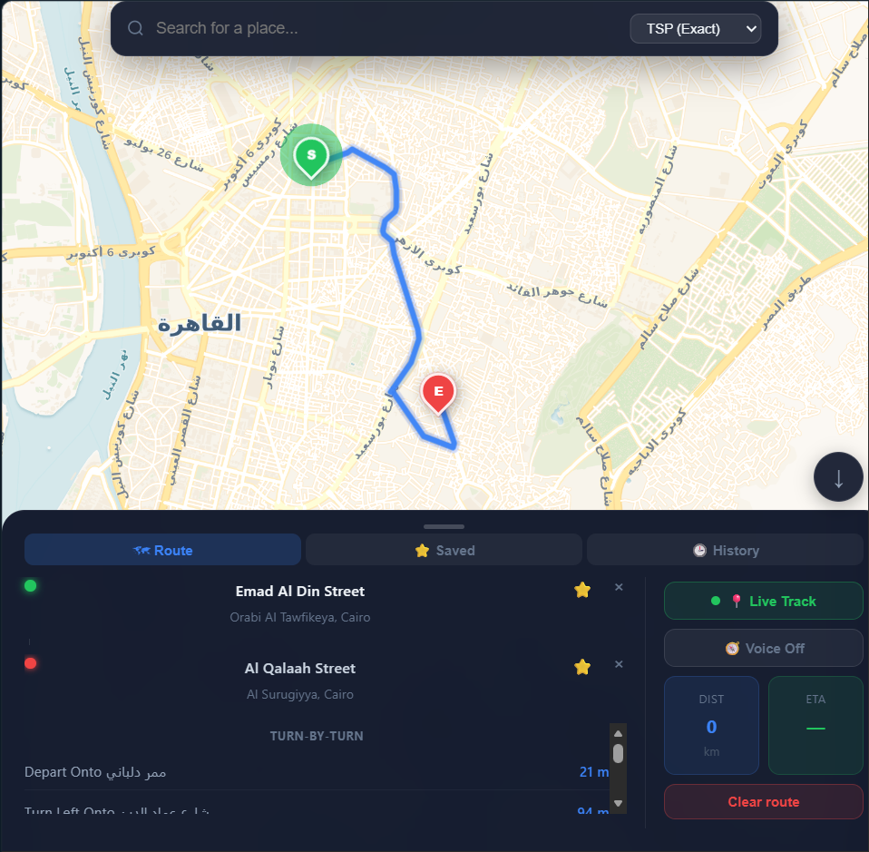

# 🚀 Smart Route Optimization System

A full-stack route optimization web application that computes optimized routes across Cairo using real-world road network data from OpenStreetMap.

The application combines graph algorithms, interactive maps, caching, and modern web technologies to provide route optimization, navigation, and route management similar to a lightweight GPS application.

> **Note:** The current implementation uses Cairo's OpenStreetMap road network for testing and development, but the architecture can be extended to support other regions.

---

# ✨ Features

## 🗺️ Route Planning

- Select a start location and multiple destinations
- Optimize routes using:
  - Greedy Algorithm (fast heuristic)
  - Traveling Salesman Problem (TSP) approximation
- Interactive map visualization
- Animated route rendering
- Turn-by-turn directions
- Real-time distance and ETA calculation

## 📍 Navigation

- Live GPS user tracking
- Automatic map updates
- Road geometry generated by OSRM
- Real road-network routing

## ⭐ User Features

- JWT Authentication
- Save favorite locations
- Route history
- Restore previous routes
- Search locations using OpenStreetMap

## ⚡ Performance Optimizations

- In-memory shortest-path cache
- MongoDB routing cache
- MongoDB geocoding cache
- Asynchronous route history saving
- Cached Cairo road graph

---

# 🏗️ Tech Stack

## Frontend

- React
- Leaflet
- Fetch API

## Backend

- Python
- Django
- Django REST Framework

## Databases

- MongoDB
- SQLite

## GIS & Routing

- OpenStreetMap (OSM)
- OSMnx
- NetworkX
- OSRM

---

# 🧠 Algorithms

## Greedy Algorithm

Visits the nearest destination at each step.

✔ Fast execution

✔ Suitable for many destinations

❌ Doesn't always produce the shortest overall route.

---

## Traveling Salesman Problem (TSP)

Computes a near-optimal visiting order before constructing the final route.

✔ Better overall routes

✔ Minimizes total travel distance

✔ Better route quality than Greedy

---

# 📡 REST API

| Method | Endpoint | Description |
|---------|----------|-------------|
| POST | `/routes/optimize-route/` | Compute optimized route |
| GET | `/routes/history/` | Retrieve route history |
| GET | `/routes/location_path/<id>/` | Retrieve saved route path |
| GET | `/routes/search-location/` | Search locations |
| GET | `/routes/favorites/` | Retrieve favorites |
| POST | `/routes/favorites/add/` | Save favorite |
| POST | `/routes/favorites/remove/` | Remove favorite |
| POST | `/api/token/` | User login |
| POST | `/api/token/refresh/` | Refresh JWT token |

---

# 🖥️ Project Architecture

```text
                   React + Leaflet
                          │
                    REST API (HTTP)
                          │
             Django REST Framework
                          │
          ┌───────────────┼───────────────┐
          │               │               │
      MongoDB          SQLite        JWT Authentication
          │
 ┌────────┼───────────┐
 │        │           │
History Favorites Routing Cache
          │
     OpenStreetMap
          │
        OSMnx
          │
      NetworkX
          │
 Route Optimization
          │
         OSRM
          │
 Geometry • ETA • Directions
```

---

# 📂 Project Structure

```text
Smart-Route-Optimization-System/

├── backend/
│   ├── routes/
│   ├── location/
│   ├── manage.py
│   └── requirements.txt
│
├── frontend/
│   ├── src/
│   ├── public/
│   ├── package.json
│   └── vite.config.js
│
├── docs/
│   └── route_system.png
│
└── README.md
```

---

# 🎥 Demo

[](https://drive.google.com/file/d/1ihGuB1abwQElcpSGMv2fycNTPMvCSLLZ/view?usp=sharing)

📹 **Click the screenshot above to watch the complete project demonstration.**

The demo showcases:

- Interactive map visualization
- Greedy & TSP route optimization
- Turn-by-turn navigation
- Route history
- Favorite locations
- Live GPS tracking

---

# ⚙️ Installation

## Requirements

- Python 3.12+
- Node.js
- MongoDB

---

## Backend

```bash
cd backend

python -m venv venv

# Linux / macOS
source venv/bin/activate

# Windows
venv\Scripts\activate

pip install -r requirements.txt

python manage.py migrate

python manage.py runserver
```

---

## Frontend

```bash
cd frontend

npm install

npm run dev
```

---

# 🚀 Future Improvements

- 🚦 Traffic visualization with segmented road colors
- 🛣️ Alternative route suggestions
- 🐳 Docker containerization
- ☁️ Cloud deployment (AWS)
- 🎙️ Voice search
- 📱 Mobile-responsive UI
- 🔔 Voice-guided navigation
- ⚡ Additional routing and caching optimizations

---

# 👨‍💻 Author

**Rania Raafat**

Backend Software Engineer

- GitHub: https://github.com/mohrael
- LinkedIn: https://linkedin.com/in/rania-raafat-694b0b261
